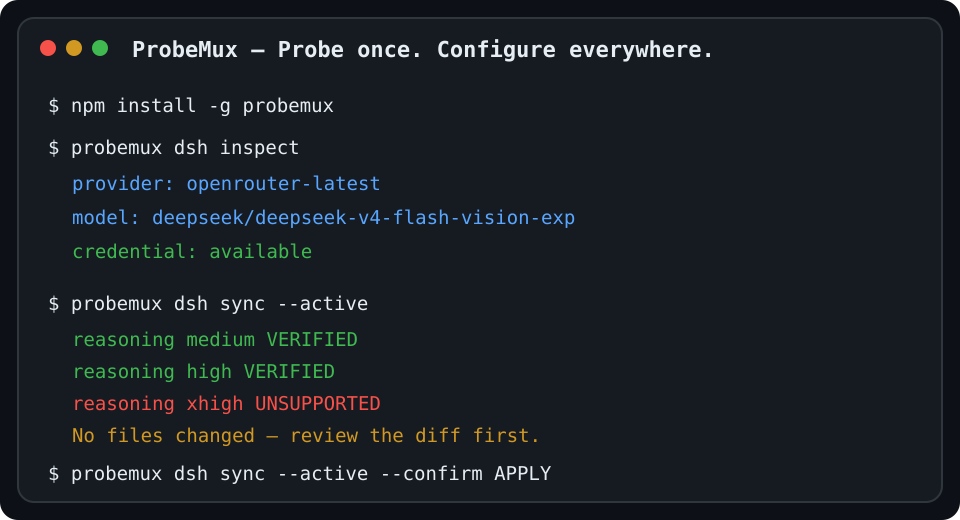

# ProbeMux

**Probe once. Configure everywhere.**

[](https://www.npmjs.com/package/probemux)
[](https://github.com/jiezeng2004-design/ProbeMux/actions/workflows/ci.yml)
[](LICENSE)
[](package.json)

> **别再给 Codex、OpenCode、DSH 分别猜一遍模型能力和 reasoning 档位。**
>
> ProbeMux 直接探测你真实使用的模型 Endpoint，只把有证据支持的能力写进配置。

同一个模型换一个中转、Provider 或 Coding Agent，配置就可能完全不一样：`reasoning.effort`、`reasoning_effort`、tool calling、developer role、Responses API……请求返回 `200` 也不代表参数真的生效。

ProbeMux 把这件事变成一条可重复的流程：

```text
Your real model endpoint
        ↓
      Probe
        ↓
Capability evidence
        ↓
Canonical Manifest
        ↓
Codex / OpenCode / DSH adapters
```

**一次探测，多个 Agent 复用同一份能力证据。**

## 适合谁

如果你经常：

- 给 Codex / OpenCode / DSH 接第三方模型或中转；
- 不确定模型到底支持哪些 reasoning effort；
- 不想手工维护多份重复配置；
- 担心“看起来能请求”但参数其实被服务端忽略；
- 想改配置前先看 diff、备份并确认；

ProbeMux 就是为这类场景做的。

## 30 秒上手：DSH

需要 Node.js 22.18+。

如果 DSH 已经配置好了 Provider、Model、Base URL 和 API Key，不需要重新输入：

```bash
npm install -g probemux
probemux dsh inspect
probemux dsh sync --active
```

前两步只读取本地配置；`sync --active` 会真实探测 Endpoint，但默认**只展示 diff，不写文件**。

确认后再应用：

```bash
probemux dsh sync --active --confirm APPLY
```

ProbeMux 会先创建时间戳备份，再原子写入，只同步已经验证的能力。

## Demo



典型工作流：

```text
inspect current model
        ↓
probe actual endpoint
        ↓
VERIFIED / LIKELY / INFERRED / UNKNOWN / UNSUPPORTED
        ↓
review diff
        ↓
backup + APPLY
```

## 为什么不是“HTTP 200 = 支持”

ProbeMux 是 evidence-first 的。

| 状态 | 含义 |
| --- | --- |
| `VERIFIED` | 有直接、可复现的端点行为或明确校验响应 |
| `LIKELY` | 有较强信号，但还不足以证明参数实际生效 |
| `INFERRED` | 来自目录、文档或其他间接证据 |
| `UNKNOWN` | 证据不足、请求失败或行为不确定 |
| `UNSUPPORTED` | Endpoint 明确拒绝该能力 |

例如：

- reasoning 档位只有在服务端行为能提供足够证据时才会标为 VERIFIED；
- tool calling 需要真实返回预期的 function/tool call；
- 单纯成功响应不会自动升级能力状态。

## 当前支持

| 能力 | 支持情况 |
| --- | --- |
| `/v1/responses` | ✅ |
| `/v1/chat/completions` | ✅ |
| Reasoning effort probing | ✅ |
| `reasoning.effort` / `reasoning_effort` | ✅ |
| `system` / `developer` role | ✅ |
| Tool / function calling | ✅ |
| Codex config adapter / render | ✅ |
| OpenCode config adapter / render | ✅ |
| DSH inspect / probe / sync | ✅ |
| Claude Code / Roo / Cline | 暂未纳入当前版本 |

Reasoning 档位覆盖：

```text
off / none / minimal / low / medium / high / xhigh / max
```

> 当前版本是 **DSH-first** 的完整原生工作流；Codex 与 OpenCode 已有 Adapter 和配置生成能力，但还没有与 DSH 完全同级的 native inspect/sync 体验。

## DSH：不重新填 Key

ProbeMux 会从现有 DSH 配置中解析：

- 当前 Provider / Model；
- Base URL；
- credential reference；
- 已有 model/provider 配置。

然后只对目标模型做最小能力 patch。

常用命令：

```bash
probemux dsh list
probemux dsh inspect
probemux dsh probe --active
probemux dsh sync --active
probemux dsh sync --active --confirm APPLY
```

也可以指定单个 Provider / Model：

```bash
probemux dsh inspect \
  --provider <provider> \
  --model <model>

probemux dsh probe --active \
  --provider <provider> \
  --model <model>
```

## 安全边界

ProbeMux 默认把“探测”和“写配置”分开：

```text
Scan → Probe → Result → Render → Diff → Backup → Apply
```

- `scan` 只读取模型目录；
- `probe` 必须显式使用 `--active` 才会向模型 Endpoint 发请求；
- 默认不会直接写配置；
- 应用前展示 diff；
- 写入前创建时间戳备份；
- 使用临时文件做原子替换；
- API Key 不写进 Capability Manifest，也不输出到日志；
- 未验证的 reasoning 档位不会被当成 VERIFIED 写入；
- 现有未知字段、其他 Provider / Model 和注释尽量保持不变。

## 通用 Endpoint 工作流

ProbeMux 不只服务 DSH。对任意 OpenAI-compatible Endpoint，也可以先生成能力 Manifest，再交给 Adapter：

```bash
PROBEMUX_API_KEY=... probemux scan \
  --base-url https://api.example.com/v1 \
  --api-key-env PROBEMUX_API_KEY \
  --output scan.json
```

后续再执行 probe / render / diff / apply 流程。

## 设计原则

ProbeMux 不试图维护一张“某模型理论上支持什么”的静态表。

它更关心：

> **你现在实际连接的这个 Endpoint，到底接受什么、拒绝什么、哪些能力能被验证。**

这也是为什么同一个模型经过不同 Provider、代理层或兼容层后，ProbeMux 的结果可能不同。

## 项目状态

当前 npm 包：

```text
probemux
```

安装：

```bash
npm install -g probemux
```

项目仍在继续扩展更多 Agent 的 native inspect/sync 体验，但不会为了“支持更多名字”牺牲探测证据和安全写入边界。

## License

MIT. See [LICENSE](LICENSE).