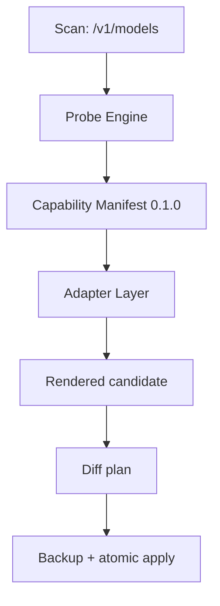
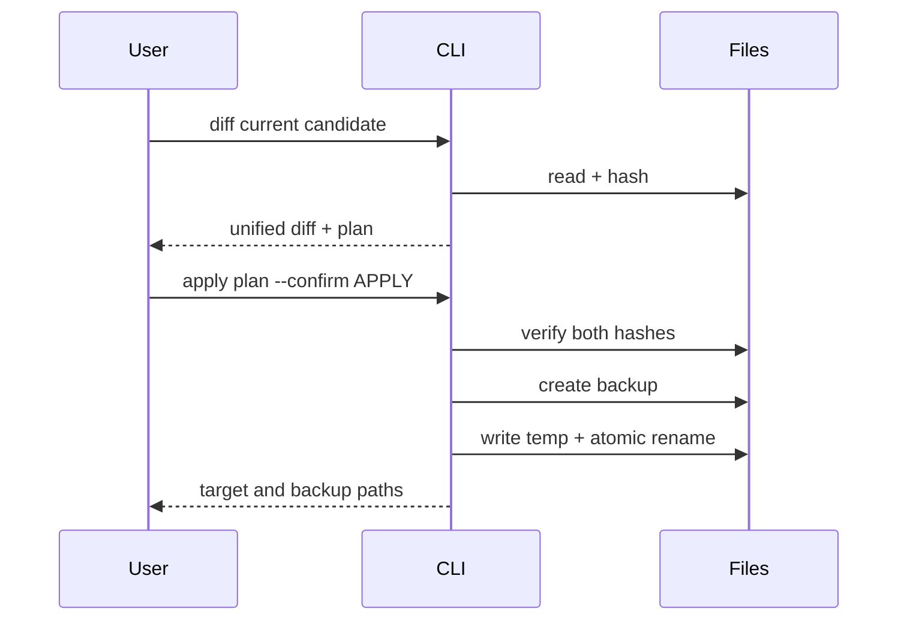

# ProbeMux v0.1.0 架构

状态：Accepted implementation baseline  
日期：2026-08-25

## 1. 架构约束

正式依赖链：

```text
Probe Engine
    ↓
Canonical Capability Manifest
    ↓
Adapter Layer
    ├── Codex Adapter
    ├── OpenCode Adapter
    └── DSH Adapter
```

Probe Engine 不得导入 Adapter、Agent SDK 或 Agent 配置类型。Adapter 不得发网络请求。

## 2. 组件



目录映射：

| 组件 | 代码 |
| --- | --- |
| 被动扫描 | `src/discovery/openai-compatible.ts` |
| Probe Engine | `src/probes/probe-engine.ts` |
| Manifest 类型/校验 | `src/domain/manifest.ts` |
| JSON Schema | `schema/capability-manifest.schema.json` |
| Adapter | `src/adapters/` |
| Diff/backup/apply | `src/config/transaction.ts` |
| CLI orchestration | `src/cli.ts` |

旧的 ModelProfile resolver、models.dev importer 和单 reasoning probe 保留为兼容基础，但不再是正式 v0.1 CLI 数据契约。

## 3. Capability Manifest

逻辑身份：

```text
endpointFingerprint + providerId + literalModelId
```

Endpoint 指纹移除 URL 用户名、密码、query 和 fragment。

Manifest 顶层：

```json
{
  "schemaVersion": "0.1.0",
  "kind": "probemux.capability-manifest",
  "identity": {},
  "protocols": {},
  "reasoning": {},
  "messageRoles": {},
  "toolCalling": {},
  "evidence": [],
  "conflicts": [],
  "generatedAt": "..."
}
```

每项能力都使用：

```json
{
  "status": "VERIFIED",
  "confidence": 0.98,
  "evidenceIds": ["probe-003"]
}
```

Status 与置信度分离：status 表示证据类别，confidence 表示当前结论强度。

## 4. Probe Engine

### 4.1 请求预算

默认完整 Probe 共 12 次：

| 类型 | 数量 |
| --- | ---: |
| Protocol baseline | 2 |
| Reasoning dialect | 4 |
| system/developer role | 4 |
| Tool calling | 2 |

必须显式传入 `active=true`。达到 `maxRequests` 后未执行项目保持 UNKNOWN。

### 4.2 Protocol 判定

| 观察 | 结果 |
| --- | --- |
| 2xx + 符合对应协议的结构化响应 | VERIFIED |
| 2xx + 缺少 Responses output/object 或 Chat choices.message | UNKNOWN |
| 404/405 且不是 model-not-found | UNSUPPORTED |
| auth、rate limit、5xx、网络错误、无判别力的 400 | UNKNOWN |

HTTP 200 不单独产生 VERIFIED。

### 4.3 Reasoning 方言

探测矩阵：

| Protocol | 首选方言 | 兼容方言 |
| --- | --- | --- |
| Responses | `reasoning.effort` | `reasoning_effort` |
| Chat Completions | `reasoning_effort` | `reasoning.effort` |

请求发送不可混淆 sentinel：`__probemux_invalid__`。

| 观察 | 结果 |
| --- | --- |
| 400 且服务端明确枚举 allowed values | 方言和列出档位 VERIFIED |
| 400 且明确 unknown/unsupported parameter | UNSUPPORTED |
| 2xx + 正确响应结构 + reasoning usage/metadata | LIKELY；不验证具体档位 |
| 2xx 但无 reasoning 直接信号 | UNKNOWN |
| 其他错误 | UNKNOWN |

因此，“请求被接受”与“参数生效”被严格区分。

### 4.4 Message role

Protocol baseline VERIFIED 后，分别插入 `system` 和 `developer`。

- 2xx + 正确结构：VERIFIED syntactic compatibility；不声称模型遵循了语义。
- 明确 role rejected：UNSUPPORTED。
- 其他：UNKNOWN。

### 4.5 Tool calling

使用固定函数 `probemux_echo`，通过 `tool_choice` 强制调用。

- 返回对应协议的真实 function call，且名称匹配：VERIFIED。
- 2xx 但只有文本：UNKNOWN。
- 明确不支持 tools/functions：UNSUPPORTED。
- ProbeMux 不执行返回调用。

### 4.6 Evidence

Evidence 只保存白名单字段：

- probe 类型；
- protocol、parameter path 或 role；
- HTTP status；
- outcome；
- 去敏、截断 detail；
- 时间、status、confidence。

不保存 API key、完整响应、模型输出正文或 chain-of-thought。

## 5. Adapter 投影

### 5.1 通用规则

```text
effective configuration
  = VERIFIED endpoint capability
  ∩ target Agent expressiveness
  ∩ verified protocol/dialect
```

渲染安全级别：

- `VERIFIED`：关键 protocol、role 和 tool 均已验证。
- `REVIEW_REQUIRED`：存在 UNKNOWN/LIKELY/INFERRED。
- `BLOCKED`：关键能力明确 UNSUPPORTED。

### 5.2 Codex

- 必须选择 Responses。
- reasoning 只消费 `reasoning.effort`。
- `model_reasoning_effort` 只映射 `minimal/low/medium/high/xhigh`。
- `off/none/max` 不写入，也不静默下调。
- 输出 `model`、`model_provider` 和 `[model_providers.<id>]`。

### 5.3 OpenCode

- Responses VERIFIED 时使用 `@ai-sdk/openai`。
- 否则选择 Chat Completions 并使用 `@ai-sdk/openai-compatible`。
- VERIFIED effort 生成 `variants.<level>.reasoningEffort`。
- 用户显式请求默认档位时，同时写入模型 `options.reasoningEffort`。
- Endpoint 和 API key 环境变量写入 provider options。

### 5.4 DSH

- 优先 Chat Completions；否则使用 Responses。
- `none` 映射为 DSH 的 `off` label，但保留 wire value `none`。
- 输出 `llm-pi-ai.providers` 下的 `models[].reasoningEfforts`、`baseURL`、`apiKeyEnv` 和 `api`。
- 用户显式请求默认档位时，输出 `agent-default-model.reasoningEffort`；未验证档位不写入。
- developer role 或 tool 未验证时给出安全警告。

## 6. 配置事务



安全条件：

- target/candidate 不能是同一文件；
- target 或 candidate 在 diff 后变化即拒绝；
- 未确认即拒绝；
- target 存在时必须先备份；
- 只应用已审阅的完整 candidate。

## 7. CLI

```text
scan      passive model discovery
probe     active endpoint capability probing
validate  manifest validation
render    pure Agent projection
diff      review + immutable hash plan
apply     backup + atomic replacement
```

## 8. 测试边界

- fake fetch 覆盖 12 请求完整 Probe。
- 覆盖 HTTP 200 错误结构不得 VERIFIED。
- 覆盖 active guard 与密钥/URL 去敏。
- 三个 Adapter 有确定性映射测试。
- 配置事务覆盖确认、备份、原子替换和 stale-plan 拒绝。
- CLI 集成测试覆盖 validate/render 与 active guard。
- 默认测试不访问真实 Endpoint。

## 9. 已知限制

- validator 是轻量运行时校验；完整 JSON Schema 由外部 validator 使用。
- reasoning 主要依赖服务端错误枚举；静默忽略参数的网关会保留 UNKNOWN。
- role VERIFIED 只代表请求结构兼容，不测试指令语义。
- v0.1 apply 不结构化 merge 任意现有 TOML/JSONC/YAML。
- DSH 仍处于快速迭代期，Adapter fixture 需要随上游变更更新。
